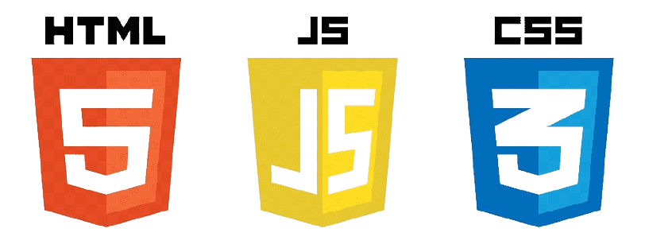
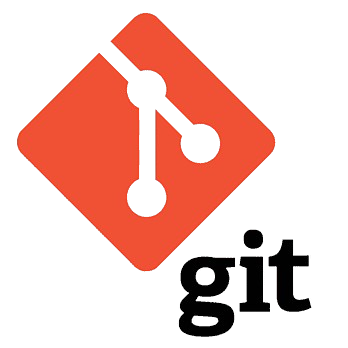
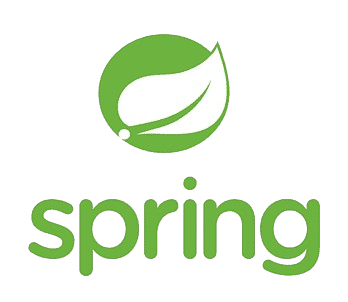

# Daniel Alejandro Rodríguez Herrera
### @danielrguezh
Estudiante de Desarrollo de Aplicaciones Multiplataforma. / App Development student.

## Languages I am currently learning and using:

  
  

## Tools I am currently learning and using:

  
  
  
  
  

  

* [The Atlas Quiz](https://github.com/danielrguezh/the-atlas-quiz)
* [Juego del Ahorcado](https://github.com/danielrguezh/Juego-del-Ahorcado)
* [Proyecto Palworld: Entornos de Desarrollo](https://github.com/danielrguezh/Proyecto-Palworld-Entornos-de-desarrollo)
